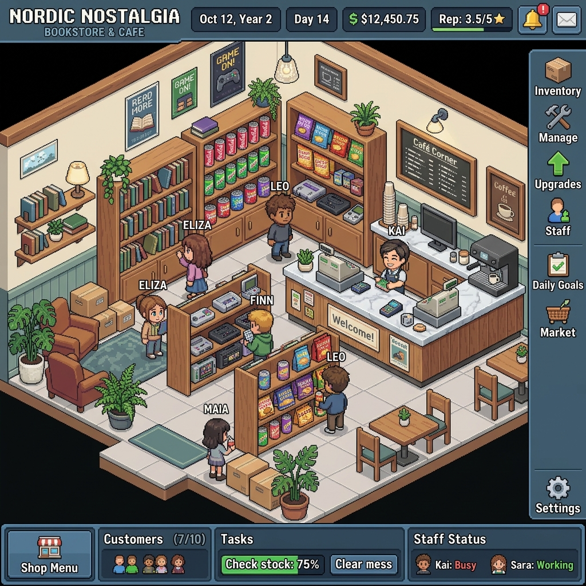

# 🏪 Isometric Store Simulator

An interactive, real-time isometric 2.5D Boutique Store Simulator modeled in retro pixel-art styling (inspired by classic gaming grids like *Habbo Hotel*). It consists of a robust **Spring Boot REST API** backend and a **Vanilla HTML5 Canvas/JavaScript** frontend.



---

## 🚀 Key Features

### 1. Retro 2.5D Isometric World
* **Spacious 14x14 Grid**: Centered camera layout with isometric projection.
* **Camera Controls (Zoom & Pan)**:
  * **Zoom**: Mouse wheel zooming (from `0.5x` to `2.5x`) centering dynamically on the cursor position.
  * **Pan**: Left-click and drag anywhere on the floor to slide the camera viewport.
* **Category-Specific Product Skins**:
  * 🥤 **Soda Cans** (`Boisson`): Red cans with white label bands and silver top tabs.
  * 🍿 **Chips Packets** (`Snack`): Yellow potato chips bags with a red logo badge.
  * 📚 **Hardcover Books** (`Culture`): Standing blue books displaying white paper pages.
  * 🎮 **Game Consoles** (`High-Tech`): Grey console boxes showing a glowing light-blue power LED.
* **Detailed Furniture & Props**:
  * **Marble Counters**: Desk structures with a dark slate base, white marble top, slanted keyboard console, and standing terminal with a glowing green screen.
  * **Cardboard Storage Crate Piles**: Textured brown storage boxes with dark gray tape straps.
  * **Welcome Door Mat**: A cozy red mat showing the greeting "WELCOME".
  * **Props**: Terracotta pots with green leaves and silver trash cans with black liner rings.

### 2. Habbo-style Animated Sprites
* **Detailed Character Skins**: Spawned characters render with rectangular pants/legs, shoes, shirts, swinging arms/sleeves, hands, and heads with visible eyes.
* **Dynamic Hairstyles**: Spawning customer PNJs are assigned unique haircuts and randomized hair colors (brown, blonde, black, red, turquoise, etc.).
* **Bobbing Motion**: Torso/head sprites oscillate vertically on a sine wave when moving, and legs slide forward and back.
* **Active Cashier**: A permanent cashier PNJ with gray hair and a green uniform shirt stands behind the marble checkout desk to handle transactions.

### 3. Smart Simulation Loop & Delivery Flow
* **PNJ Shopping FSM**: Customers spawn at the door mat, navigate to product shelves using a **Breadth-First Search (BFS) pathfinder** avoiding obstacles, fill their carts, queue up at the checkout counter, pay, and exit the store.
* **Automated Restocking**: When inventory drops below a threshold (default: 10 units), the backend creates a restock order. A delivery truck slides in from the left and spawns a Delivery Worker who carries a cardboard box to the storage zone, replenishes the shelves, and drives away.
* **Financial Model**: Track revenues, starting capital, transaction statistics, and restock costs in real-time.

### 4. Enterprise Observability & Exception Handling
* **SLF4J Backend Logs**: Full trace logs highlighting client spawn values, validation failures (budget constraints, out-of-stock items), transaction records, and restock sequences.
* **CORS Support & REST Controller Advice**: Intercepts custom exceptions (`StockInsuffisantException`, `SoldeInsuffisantException`) and maps them to clean client-facing JSON payloads.

---

## 🛠️ Technology Stack

* **Backend**: Java 21, Spring Boot 3.x (Web, JPA, Validation), H2 Database (In-Memory), Maven.
* **Frontend**: HTML5 Canvas, Vanilla CSS3 (Glassmorphism Nord UI theme), Vanilla JavaScript.
* **Tests**: JUnit 5, Mockito, Cucumber (BDD specifications).
* **CI/CD**: GitHub Actions (Ubuntu, Java 21, Maven dependencies caching).

---

## 📂 Project Structure

```text
├── .github/workflows/
│   └── ci.yml               # GitHub Actions CI pipeline
├── backend/
│   ├── src/
│   │   ├── main/            # JPA Entities, Services, Controllers, Mappings
│   │   └── test/            # Mockito Unit Tests & Cucumber CucumberTest runner
│   └── pom.xml              # Maven parent pom
├── frontend/
│   ├── index.html           # UI console & Canvas panel
│   ├── index.css            # Styling & stock progress bars
│   └── app.js               # Isometric rendering loop & FSM logic
├── README.md                # Project documentation
├── preview.png              # Mockup illustration
└── .gitignore               # Ignored files list
```

---

## ⚙️ Running the Project

### 1. Launch the Spring Boot Backend
Make sure you have JDK 21 and Maven installed:
```bash
cd backend
mvn spring-boot:run
```
The server will start at `http://localhost:8080`. H2 console is available at `http://localhost:8080/h2-console` (JDBC URL: `jdbc:h2:mem:shopsim`).

### 2. Launch the Isometric Frontend
Simply open `frontend/index.html` in your web browser. 
* Click **Démarrer** in the control panel to launch.
* Scroll to zoom, left-click and drag to move, and observe the logs scrolling by!

---

## 🧪 Testing and CI/CD

### Run Tests Locally
To run the BDD Cucumber specs and unit test suite:
```bash
cd backend
mvn clean test
```

### GitHub Actions Pipeline
Every push or pull request to the `main` or `master` branch triggers the GitHub workflow in `.github/workflows/ci.yml`. The job executes:
1. Codes checkout.
2. Setup of JDK 21 (Temurin).
3. Dependency caching for Maven.
4. Test execution via `mvn -B clean test`.
